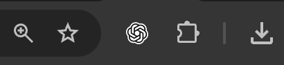

# 모아 — 웹페이지를 나만의 학습자료로

웹페이지에서 필요한 부분을 모아 PDF로 저장하는 **크롬 확장 프로그램**입니다.
[https://libgen.dkyobobook.co.kr/main.ink](https://libgen.dkyobobook.co.kr/main.ink)
저는 이 사이트에서 보통 사용합니다.
다른 사이트는 잘 모르겠어요.

[**⬇ 최신 버전 다운로드**](https://github.com/thighburger/study-capture/releases/latest/download/study-capture-extension.zip) · [버전별 변경 내용](https://github.com/thighburger/study-capture/releases)

## 1. 파일 다운로드하기

1. [https://github.com/thighburger/study-capture/releases/latest/download/study-capture-extension.zip](https://github.com/thighburger/study-capture/releases/latest/download/study-capture-extension.zip)
이 파일을 다운로드 합니다.
2. `study-capture-extension.zip` 파일이 다운로드됩니다.
3. 압축을 해제해주세요

## 2. 크롬에 설치하기

1. **Google Chrome**을 실행합니다.
2. 맨 위 주소창에 아래 주소를 입력합니다.

    ```
    chrome://extensions
    ```

3. 열린 화면 오른쪽 위의 **개발자 모드** 스위치를 켭니다.
4. 왼쪽 위에 나타나는 **압축해제된 확장 프로그램을 로드합니다** 버튼을 누릅니다.
5. 1단계에서 압축해제된 폴더를 선택합니다.
6. 목록에 **모아 — 학습자료 캡처** 카드가 나타나고, 카드의 사용 스위치가 켜져 있으면 설치 완료입니다.

**그냥 폴더 드래그앤드롭해도 돼요**

## 3. 모아 아이콘 고정하기

1. 크롬 오른쪽 위의 **퍼즐 모양 아이콘(확장 프로그램)**을 누릅니다.



2. 목록에서 **모아 — 학습자료 캡처**를 찾습니다.
3. 옆의 **핀 모양 아이콘**을 눌러 고정합니다.

이제 주소창 옆에서 모아 아이콘을 바로 누를 수 있습니다. 고정하지 않았어도 퍼즐 메뉴에서 모아를 누르면 열립니다.

# 시연 영상

[시연 영상 보기·다운로드 (.mov)](https://github.com/thighburger/study-capture/releases/download/v1.2.1/study-capture-demo.mov)
